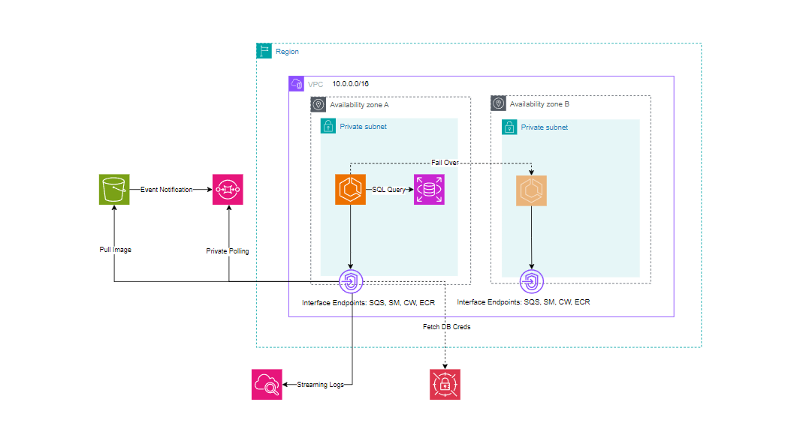

# Nexus: Secure Event-Driven Pipeline

Nexus is a production-grade, "Zero-Trust" event-driven architecture built with AWS CDK. It demonstrates a robust pattern for processing file uploads privately and securely without any public internet exposure.

## Architecture Overview

### Architecture Diagram



Nexus utilizes a multi-layered security approach combined with an event-driven execution model.

## Key Features

- **Zero-Trust Network Design**: All compute and data resources reside in `PRIVATE_ISOLATED` subnets with zero public internet ingress/egress.
- **Event-Driven Pipeline**: Decoupled architecture using S3 Event Notifications and SQS for reliable message delivery.
- **Serverless Compute**: Fully managed ECS Fargate worker that scales independently of the database.
- **Automated Secret Rotation**: Leverages AWS Secrets Manager for seamless, secure RDS credential injection without hardcoded passwords.
- **Modern RDS Stack**: Running PostgreSQL 17.6 on AWS Graviton2 (T4g) for superior price-to-performance.
- **Full IaC Integration**: 100% typed Infrastructure-as-Code using AWS CDK, including automated Docker image builds and ECR publishing.
- **Multi-Stage Docker Build**: Optimized production container for minimal security footprint and fast deployments.
- **Built-in Backpressure**: Polling-based consumption ensures the worker never overwhelms the database during traffic spikes.
- **Infrastructure Auditing**: Integrated `cdk-nag` for automated security and compliance checks during the synthesis phase.

### Data Flow
1. **Ingestion**: A user uploads a `.txt` file to the **S3 Bucket**.
2. **Notification**: S3 sends an event notification to the **SQS Queue**.
3. **Consumption**: The **Fargate Worker** (polling SQS) picks up the message.
4. **Processing**: The worker downloads the file content from S3 over a private Gateway Endpoint.
5. **Persistence**: The worker inserts the file the content and metadata into the **RDS PostgreSQL** database.
6. **Cleanup**: The worker deletes the message from SQS upon successful processing.

### Networking & Security ("Zero-Trust" Model)
- **VPC Isolation**: All resources (Fargate and RDS) are located in **Private Isolated Subnets**. There is no Internet Gateway (IGW) or NAT Gateway.
- **VPC Endpoints**: Secure, private connections to AWS services are handled via Gateway (S3) and Interface (SQS, ECR, CloudWatch, Secrets Manager) Endpoints.
- **Identity Management**: The Worker uses a least-privileged IAM Task Role to access specific AWS resources.
- **Secret Management**: Database credentials are automatically generated and stored in **AWS Secrets Manager**, then injected into the Fargate container at runtime.
- **Security Auditing (cdk-nag)**: Every resource is validated against the **AWS Solutions** NagPack. This ensures that S3 buckets, RDS instances, and VPC configurations meet cloud security best practices before deployment.

## Technology Stack

- **Infrastructure**: AWS CDK (TypeScript)
- **Compute**: AWS ECS Fargate (vCPU: 0.25, RAM: 512MB)
- **Database**: Amazon RDS PostgreSQL 17.6 (db.t4g.micro - Graviton)
- **Messaging**: Amazon SQS
- **Storage**: Amazon S3
- **Language**: TypeScript (Node.js 20)
- **Containerization**: Docker (Multi-stage build)

- **Built-in Backpressure**: Polling-based consumption ensures the worker never overwhelms the database during traffic spikes.

## Infrastructure Trade-offs & Resilience

This architecture makes a deliberate "Phase 1" design choice to balance professional resilience with AWS Free Tier cost constraints.

| Component | Status | Resilience Strategy |
| :--- | :--- | :--- |
| **Compute (ECS)** | **Multi-AZ** | Automatically recovers in the secondary Availability Zone during hardware maintenance or sub-AZ failures. |
| **Database (RDS)** | **Single-AZ** | Currently cost-optimized for the Free Tier. While it acts as a Single Point of Failure during a total AZ collapse, the VPC and Subnet Groups are already "HA-Ready" for a one-line upgrade (`multiAz: true`). |
| **Networking** | **Highly Available** | VPC Endpoints and Subnets are provisioned across two physical data centers from Day 1. |

## Getting Started

### Prerequisites
- Node.js & pnpm
- AWS CLI configured with appropriate credentials
- Docker Desktop (active for building the worker image)

### Deployment
```powershell
# Install dependencies
pnpm install

# Deploy the stack
pnpm exec cdk deploy
```

### Infrastructure Linting
Before deploying, you can run a security audit on your infrastructure:
```powershell
pnpm lint:nag
```
*Note: This runs `cdk synth` with `cdk-nag` enabled to catch security misconfigurations. Synthesis will fail if any errors are found.*

### Testing the Pipeline
1. Get the bucket name from the CDK output or S3 console.
2. Upload a text file:
   ```powershell
   echo "Hello from Nexus!" | aws s3 cp - s3://your-bucket-name/hello.txt
   ```
3. Monitor logs in CloudWatch Logs under the `/ecs/Nexus` log group.

### Cleanup
To avoid ongoing AWS charges (especially for VPC Endpoints and RDS), destroy the stack when finished:
```powershell
pnpm exec cdk destroy
```

## Repository Structure
- `bin/`: CDK app entry point.
- `lib/`: Infrastructure-as-Code definitions (VPC, RDS, ECS, etc.).
- `src/`: Worker logic (S3/SQS/PG integration).
- `Dockerfile`: Multi-stage build for the secure production container.
